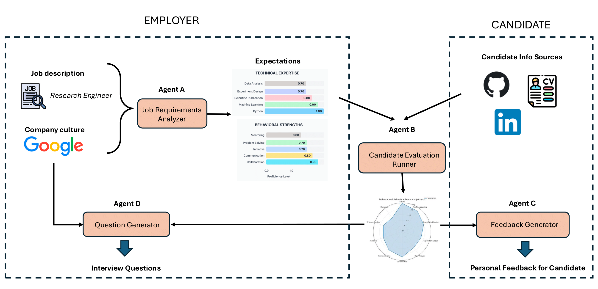

# SkillSense – Unlock Your Hidden Potential

> "Refresh the market. Accepting the best, consulting the rest."

## Overview

SkillSense is our submission for the **Corporate Track (SAP Challenge)**. The goal is
simple but ambitious: uncover the full range of an individual's abilities, including
skills that traditional résumés overlook. We combine AI-driven document synthesis,
candidate evaluation, interview-prep question generation, and hyper-personalized
feedback into a cohesive pipeline that answers the question: **What am I good at?**

The system ingests job descriptions, candidate profiles (CVs, LinkedIn data, etc.), and
generates:

- Structured job requirements and competency weights.
- Candidate affinity scores and feature-level evaluations.
- Personalized feedback for non-selected applicants.
- Targeted interview questions tailored to each candidate.

All of this is exposed through a unified FastAPI service so it can plug seamlessly into
experiments, internal dashboards, or Lovable front-ends.

## Motivation & Goal

Hiring is moving from credentials to capabilities, yet most tools still revolve around
résumés and known qualifications. Informal learning, mentorship outcomes, freelance
projects—even micro-achievements—rarely surface in traditional workflows. This leads to:

- **Individuals** missing chances to demonstrate their true value.
- **Employers** lacking visibility into the “hidden” or emerging skills across talent pools.
- **HR operations** running on out-of-date or incomplete evidence.

SkillSense tackles these pain points by orchestrating AI agents that continuously
collect, analyze, and synthesize skill signals into actionable insights for both
candidates and organizations.

## Architecture at a Glance



## Repository Structure

| Path / File                            | Description |
|----------------------------------------|-------------|
| `main.py`                              | Orchestrates end-to-end workflow (job analysis → evaluation → feedback for one candidate).
| `app.py`                               | FastAPI application exposing `/analyze_job`, `/evaluate_candidates`, `/generate_feedback`.
| `src/job_requirements_analyzer.py`     | Scrapes job postings, extracts technical & behavioral features, assigns weights.
| `src/candidate_evaluation_runner.py`   | Loads job requirements, evaluates candidates, ranks them, persists results.
| `src/candidate_evaluator.py`           | Evaluation core (uses `candidate_profile_evaluator`).
| `src/candidate_profile_evaluator.py`   | Reads candidate documents (CV/LinkedIn), calls Google GenAI for feature scoring.
| `src/candidate_feedback_generator.py`  | Generates personalized growth feedback for one candidate.
| `src/question_generator.py`            | Agent D: generates interview questions tailored to a single candidate.
| `requirements.txt`                     | Python dependencies.

## Prerequisites

- Python 3.11+
- Google Cloud project with Vertex AI access (Gemini models) and corresponding service
  credentials or env vars.
- Optional: Supabase / Lovable front-end (not required to run the core pipeline).

## Setup

```bash
# 1. Clone repo
git clone https://github.com/ashabou/GlobalAI.git
cd GlobalAI

# 2. Create & activate virtual environment
python3 -m venv .venv
source .venv/bin/activate      # Windows: .venv\Scripts\activate

# 3. Install dependencies
pip install -r requirements.txt

# 4. Configure environment
cp .env.example .env           # edit GOOGLE_CLOUD_PROJECT, etc.

# 5. Unpack the provided data bundle (contains sample CVs, evaluations…)
unzip data.zip -d data
```

Ensure the following env variables are set (via `.env` or environment):

- `GOOGLE_CLOUD_PROJECT`
- `GOOGLE_CLOUD_LOCATION` (default `us-central1`)
- Any additional credentials required by `google-genai` (ADC or service account).

## How to Run

### FastAPI Service (for Lovable / API callers)

```bash
fastapi dev app.py
```

Endpoints:

| Method | Path                 | Description |
|--------|----------------------|-------------|
| `GET`  | `/health`            | Health check |
| `POST` | `/analyze_job`       | Run Agent A (job requirements) |
| `POST` | `/evaluate_candidates`| Run Agent B (candidate scoring) |
| `POST` | `/generate_feedback` | Run Agent C for a single candidate |

Example request body (Agent A):
```json
{
  "url": "https://example.com/job/123",
  "company": "Example Corp",
  "n": 5
}
```

Example request body (Agent B):
```json
{
  "job_file": "data/job_requirements.json",
  "output_dir": "data"
}
```

Example request body (Agent C):
```json
{
  "candidate_id": 6,
  "evaluations_file": "data/candidate_evaluations.json",
  "requirements_file": "data/job_requirements.json",
  "output_summary": "data/candidate_feedback.json",
  "feedback_dir": "data/feedback"
}
```

### Command-Line Workflow (one candidate)

```bash
python main.py \
  https://example.com/job/123 \
  --company "Example Corp" \
  --candidate-id 6
```

This orchestrates all agents sequentially and saves artifacts in `data/`.

### Question Generation (Agent D)

```
python src/question_generator.py 6
```
Saves the resulting question set under `data/questions/` (created from the unpacked zip).

## Technical Highlights

- **FastAPI-first design** with CORS enabled for easy front-end integration.
- **Google GenAI (Gemini 2.x)** for structured outputs (job features, candidate scoring,
  feedback, interview questions).
- **Robust file-handling** and path resolution so relative/absolute inputs both work.
- **Modular agents** that can be run independently or orchestrated via `main.py`.
- **Extensible JSON schemas** to support downstream analytics, dashboards, or LLM chains.

## Future Directions

- Integrate information sources (e.g. Google Scholar, blogs, etc.) to augment the
  generated candidateprofiles.
- Expand feedback to include recommended learning paths from external providers.
- Attach question generator to Lovable workflows so recruiters can instantly prepare
  interviews.
- Reinforce fairness and transparency: add bias mitigation and explainable scoring.

## License

MIT (see `LICENSE` if included) or specify your preferred license.

## Acknowledgements

Thanks to SAP Challenge mentors and Ramanpreet Khinda for his mentorship. SkillSense wouldn’t exist without your support.

