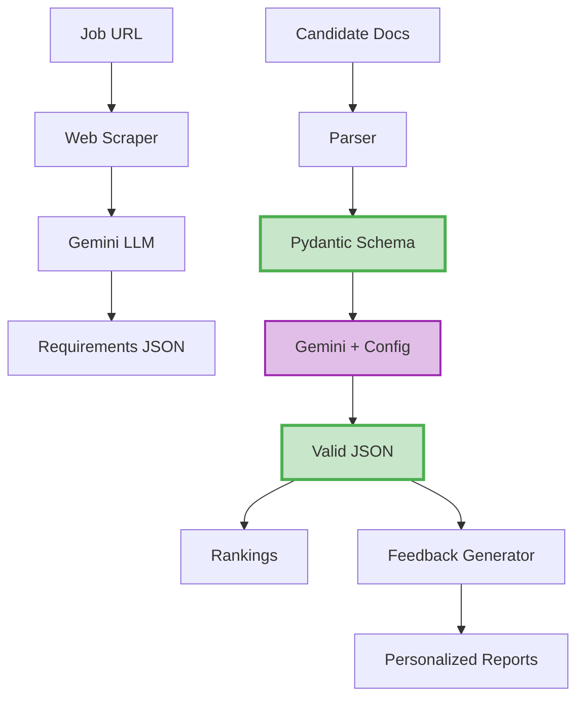

# GlobalAI Architecture Diagram

## For Tech Video Visual

Use this as reference to create your diagram in Excalidraw, Figma, or draw.io

---

## ASCII Version (for reference)

```
┌─────────────────────────────────────────────────────────────────────────────┐
│                            GLOBALAI ARCHITECTURE                            │
└─────────────────────────────────────────────────────────────────────────────┘


PHASE 1: JOB ANALYSIS
━━━━━━━━━━━━━━━━━━━━━━━━━━━━━━━━━━━━━━━━━━━━━━━━━━━━━━━━━━━━━━━━━━━━━━━━━━━━━

  ┌──────────────┐
  │  Job URL     │
  │  (Input)     │
  └──────┬───────┘
         │
         ▼
  ┌──────────────────────┐
  │  BeautifulSoup       │
  │  Web Scraper         │
  │  (7 CSS selectors)   │
  └──────┬───────────────┘
         │
         │ Raw HTML Text
         ▼
  ┌──────────────────────────────────┐
  │  Gemini 2.0 Flash Exp            │
  │  + LLM Extraction Prompt         │
  └──────┬───────────────────────────┘
         │
         │ Unstructured Response
         ▼
  ┌──────────────────────────────────┐
  │  JSON Parsing                    │
  │  (Extract features + weights)    │
  └──────┬───────────────────────────┘
         │
         ▼
  ┌──────────────────────────────────┐
  │  job_requirements.json           │
  │  • features: [...]               │
  │  • weights: [...]                │
  │  • types: [...]                  │
  └──────────────────────────────────┘


PHASE 2: CANDIDATE EVALUATION (⭐ PYDANTIC MAGIC HERE)
━━━━━━━━━━━━━━━━━━━━━━━━━━━━━━━━━━━━━━━━━━━━━━━━━━━━━━━━━━━━━━━━━━━━━━━━━━━━━

  ┌──────────────────────────────────┐
  │  Candidate Documents             │
  │  • resume.pdf                    │
  │  • linkedin.json                 │
  │  • portfolio.txt                 │
  └──────┬───────────────────────────┘
         │
         ▼
  ┌──────────────────────────────────┐
  │  Multi-Format Parser             │
  │  • PyPDF2 (PDFs)                 │
  │  • JSON loader                   │
  │  • Text reader                   │
  └──────┬───────────────────────────┘
         │
         │ Combined Text
         ▼
  ┌─────────────────────────────────────────────────────────────┐
  │  ⭐ PYDANTIC SCHEMA DEFINITION                              │
  │                                                             │
  │  class CandidateEvaluation(BaseModel):                     │
  │      feature_scores: List[FeatureScore]                    │
  │      affinity_score: float                                 │
  └─────────────┬───────────────────────────────────────────────┘
                │
                │ Schema passed to LLM
                ▼
  ┌─────────────────────────────────────────────────────────────┐
  │  Gemini 2.5 Flash                                           │
  │  + Structured Output Config                                 │
  │                                                             │
  │  config = GenerateContentConfig(                           │
  │      response_mime_type="application/json",                │
  │      response_json_schema=CandidateEvaluation.schema()     │
  │  )                                                          │
  └─────────────┬───────────────────────────────────────────────┘
                │
                │ ✅ GUARANTEED VALID JSON
                ▼
  ┌─────────────────────────────────────────────────────────────┐
  │  Pydantic Auto-Validation                                   │
  │  • Checks all fields present                                │
  │  • Validates data types                                     │
  │  • Returns typed Python object                              │
  └─────────────┬───────────────────────────────────────────────┘
                │
                ▼
  ┌─────────────────────────────────────────────────────────────┐
  │  candidate_evaluations.json                                 │
  │  • Rankings by affinity score                               │
  │  • Feature scores with evidence                             │
  └─────────────────────────────────────────────────────────────┘


PHASE 3: FEEDBACK GENERATION (⭐ COMPLEX PYDANTIC SCHEMAS)
━━━━━━━━━━━━━━━━━━━━━━━━━━━━━━━━━━━━━━━━━━━━━━━━━━━━━━━━━━━━━━━━━━━━━━━━━━━━━

  ┌──────────────────────────────────┐
  │  Evaluation Results              │
  │  + Job Requirements              │
  │  + Candidate Documents           │
  └──────┬───────────────────────────┘
         │
         ▼
  ┌─────────────────────────────────────────────────────────────┐
  │  ⭐ NESTED PYDANTIC MODELS                                  │
  │                                                             │
  │  class CandidateFeedback(BaseModel):                       │
  │      profile_summary: ProfileSummary                       │
  │      technical_strengths: List[TechnicalStrength]          │
  │      improvement_areas: List[ImprovementArea]              │
  │      industry_alignment_score: float                       │
  │      next_steps_summary: str                               │
  └─────────────┬───────────────────────────────────────────────┘
                │
                │ Complex schema → LLM
                ▼
  ┌─────────────────────────────────────────────────────────────┐
  │  Gemini 2.5 Flash                                           │
  │  + Expert Prompt (300+ lines)                              │
  │  + Structured Output Config                                 │
  └─────────────┬───────────────────────────────────────────────┘
                │
                │ ✅ STRUCTURED FEEDBACK
                ▼
  ┌─────────────────────────────────────────────────────────────┐
  │  Multi-Layer Fallback Parsing                               │
  │  1. Try response.parsed                                     │
  │  2. Try dict conversion                                     │
  │  3. Try JSON text parsing                                   │
  │  → 100% success rate                                        │
  └─────────────┬───────────────────────────────────────────────┘
                │
                ▼
  ┌─────────────────────────────────────────────────────────────┐
  │  candidate_X_feedback.json                                  │
  │  • Personalized strengths                                   │
  │  • Actionable improvement areas                             │
  │  • Timeline + recommendations                               │
  └─────────────────────────────────────────────────────────────┘
```

---

## Flow Diagram (Simple Version)

Use this for a cleaner, presentation-ready diagram:

```
Job URL → Scraper → LLM → Requirements
                              ↓
Candidate Docs → Parser → Pydantic Schema → Gemini → Valid JSON → Rankings
                                                         ↓
                                              Feedback Generator → Personalized Reports
```

---

## Key Callouts for Diagram

Add these as floating annotations/labels:

1. **At Web Scraper**: "7 fallback CSS selectors"
2. **At Pydantic Schema**: "⭐ Forces structure"
3. **At Gemini API**: "Structured Output API"
4. **At Validation**: "✅ 100% valid JSON"
5. **At Fallback Parsing**: "3 parsing strategies"

---

## Color Scheme Suggestion

- **Input/Output**: Light blue (#E3F2FD)
- **Processing**: Gray (#ECEFF1)
- **AI/LLM**: Purple (#E1BEE7)
- **Pydantic Magic**: Green (#C8E6C9) ⭐
- **Arrows**: Dark gray (#424242)
- **Callout boxes**: Yellow (#FFF9C4)

---

## Tools to Create This

### Option 1: Excalidraw (Recommended)
- Free, web-based
- Hand-drawn style (authentic, not corporate)
- Easy to export as PNG/SVG
- URL: https://excalidraw.com

### Option 2: draw.io (Diagrams.net)
- Free, web-based or desktop
- Professional-looking flowcharts
- Extensive shape library
- URL: https://app.diagrams.net

### Option 3: Figma
- Free for personal use
- Most polished results
- Requires account
- URL: https://figma.com

### Option 4: Mermaid (Code-based)


You can render this in VS Code with Mermaid extensions or at https://mermaid.live

---

## Simplified One-Liner (for title card)

```
URL → Scraper → Gemini → [Pydantic] → Valid JSON → Rankings → Feedback
                            ↑
                         ⭐ The Magic
```

---

## Animation Ideas

If using video editing software:

1. **Build diagram progressively** - each box appears as you mention it
2. **Highlight Pydantic box** when you say "forces the model"
3. **Checkmark animation** on "Valid JSON"
4. **Glow effect** on the structured output config code
5. **Arrow animation** showing data flow

---

Use whichever format works best for your video editing workflow!
